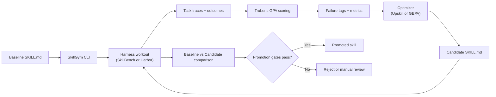
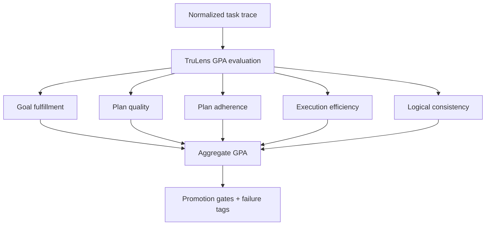
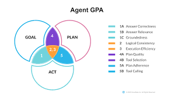

# SkillGym

SkillGym improves `SKILL.md` files with a benchmark loop:

1. Run tasks with a harness (`skillbench` or `harbor`)
2. Score behavior (TruLens GPA dimensions)
3. Generate candidate skill text (`upskill` or `gepa`)
4. Re-run and promote only if gates pass

Think of it as: your skill goes to the gym, does workouts, and only graduates if it gets fitter.

## System picture



## GPA picture



Static PNG version:



## Step-by-step (fastest path)

### 1) Prerequisites

- Python `>=3.11`
- Docker

### 2) Install

```bash
git clone https://github.com/zetomatoz/SkillGym.git
cd SkillGym
python -m pip install -e .
cp .env.example .env
```

For local demo runs, `OPENAI_API_KEY` is optional (SkillGym may use fallback scoring/generation).

### 3) Run the reproducible Docker E2E demo

```bash
./scripts/run_e2e_skillbench_demo.sh
```

This command:

- builds the local SkillBench-compatible Docker image in `integrations/skillbench/mock/`
- evaluates a weak baseline skill in `skills/e2e-poor-skill/SKILL.md`
- generates a candidate skill and compares baseline vs candidate

### 4) Inspect outputs

- Report: `out/e2e-skillbench/reports/candidate_diff.md`
- Decision: `out/e2e-skillbench/reports/promotion_decision.json`
- Candidate skill: `out/e2e-skillbench/generated_skills/`

## Real integrations (no mocks/fallbacks)

SkillGym now supports strict real mode for Harbor/SkillBench + TruLens.

Prerequisites:

- Harbor CLI installed (`uv tool install harbor`)
- `OPENAI_API_KEY` set
- local SkillBench checkout (for `tasks/`) or any Harbor task/dataset path

Run with SkillBench tasks through Harbor:

```bash
./scripts/run_real_skillbench_e2e.sh /absolute/path/to/skillsbench/tasks
```

Run with a Harbor task/dataset path:

```bash
./scripts/run_real_harbor_e2e.sh /absolute/path/to/harbor/tasks-or-dataset
```

Both scripts use `--strict-real`, which means:

- no simulator fallback
- no heuristic TruLens fallback
- no heuristic Upskill fallback

## Run SkillGym on your own skill

Replace `--skill-path` with your own `SKILL.md`:

```bash
skillgym \
  --harness skillbench \
  --skillbench-registry benchmarks/e2e_skillbench.json \
  --dataset-id e2e-skillbench \
  --skill-path /path/to/your/SKILL.md \
  --optimizer upskill \
  --output-dir out/my-run
```

## Use real SkillBench / Harbor

- SkillBench project: [benchflow-ai/skillsbench](https://github.com/benchflow-ai/skillsbench)
- Harbor docs: [harborframework.com/docs](https://harborframework.com/docs)
- Set container images in `.env`:
  - `SKILLBENCH_DOCKER_IMAGE=...`
  - `HARBOR_DOCKER_IMAGE=...`
- Or use Harbor CLI/task-path mode:
  - `SKILLBENCH_CMD=harbor`
  - `SKILLBENCH_TASKS_PATH=/path/to/skillsbench/tasks`
  - `HARBOR_CMD=harbor`
- SkillBench contract details: `integrations/skillbench/README.md`

## Architecture (quick map)

- `src/cli.py` — CLI entrypoint and wiring
- `src/orchestrator/pipeline.py` — baseline/candidate loop
- `src/adapters/` — harness adapters (`harbor.py`, `skillbench.py`)
- `src/scoring/trulens_adapter.py` — GPA scoring
- `src/optimization/` — optimizer adapters
- `src/promotion/decider.py` — promotion gates
- `skills/README.md` — skill assets and how they map to demo/real runs
