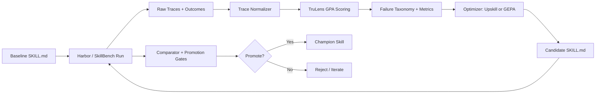

# SkillGym
## Continuous Skill Improvement for Coding Agents

- Tagline: *Send your skill to the gym. Promote it only when it gets fitter.*
- Team focus: benchmark-driven, trace-aware, optimizer-agnostic skill improvement

---

# Problem

- `SKILL.md` quality is mostly improved manually.
- Pass/fail alone hides bad behavior (tool misuse, drift, inefficiency).
- Skill changes are hard to compare reproducibly across runs and models.

---

# Why Now

- Teams are shipping more agentic workflows, but skill iteration is still ad hoc.
- We now have strong building blocks:
  - **Harbor** for realistic benchmark execution
  - **TruLens GPA** for trace quality assessment
  - **Upskill/GEPA** for candidate generation

---

# Solution: SkillGym

SkillGym is a closed-loop optimizer for agent skills:

1. Run baseline skill on benchmark workouts
2. Score outcomes + trace quality
3. Generate candidate skill text
4. Re-run on same slice
5. Promote only if gates pass

---

# Product Analogy

- A skill goes to **SkillGym** to get fit.
- Workouts are benchmark tracks:
  - **SkillBench** (isolated skill workouts)
  - **GPA** (in-agent behavioral workouts)
  - future plugins for full-body optimization

---

# Architecture

---

# Core Value

- Improves both **what happened** (pass rate) and **how it happened** (behavior quality).
- Turns traces into actionable skill edits.
- Keeps changes measurable, reproducible, and reversible.

---

# What Makes It Different

- **Harness-first**: every candidate is benchmarked, not guessed.
- **Trace-aware**: plan quality/adherence/efficiency are first-class.
- **Optimizer-agnostic**: swap Upskill and GEPA without changing measurement plane.
- **Safe promotion**: hard gates prevent dangerous regressions.

---

# MVP in Repo Today

- CLI loop: baseline -> candidate -> compare -> decision
- Harness adapters:
  - Harbor
  - SkillBench (Harbor-backed path + Docker contract path)
- GPA evaluator with strict real mode support
- Candidate generation via Upskill/GEPA adapters
- Decision artifacts (`candidate_diff.md`, `promotion_decision.json`)

---

# Demo Flow (5 minutes)

1. Start from a weak baseline `SKILL.md`
2. Run benchmark workout
3. Show low pass rate / GPA failure tags
4. Generate candidate skill
5. Re-run and show measurable deltas
6. Gate-based promotion decision

---

# Success Metrics

- Delta pass rate
- Delta aggregate GPA + per-dimension GPA
- Catastrophic failure rate (must not regress)
- Token and latency budget adherence

---

# Roadmap

1. Improve stub quality to be more trace-grounded in local demos
2. Tighten real Harbor + TruLens + SkillBench integrations
3. Add multi-model transfer evaluations
4. Add leaderboard/dashboard and run registry
5. Hybrid optimizer strategy (Upskill seeding GEPA populations)

---

# Ask

- Adopt SkillGym as the standard loop for any high-impact `SKILL.md`.
- Start with one benchmark slice, one skill, one weekly promotion cadence.
- Scale once promotion gates and trace diagnostics prove stable.
